# Deprived Extension (ongoing) 
## (2026)

Arachnids have been roaming the planet for over 400 million years, with a 
new record breaking fossil just recently being found. Predating trees and 
much of terrestrial fauna, they were amongst the first land-based hunters 
of other arthropods. The production of silk, — a temporary architecture — 
later evolving in the lineage of Spiders roughly 300 million years ago 
functions not only as a habitat, but as an extended sensory apparatus, 
distributing perception across ground and later air.

	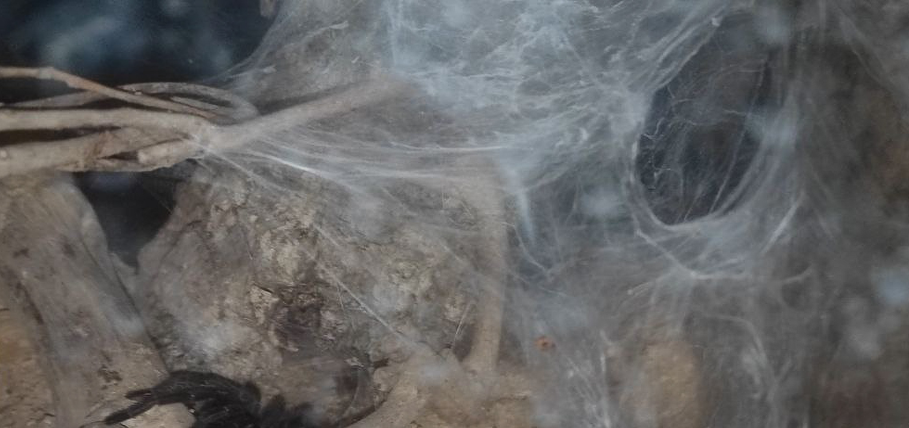
	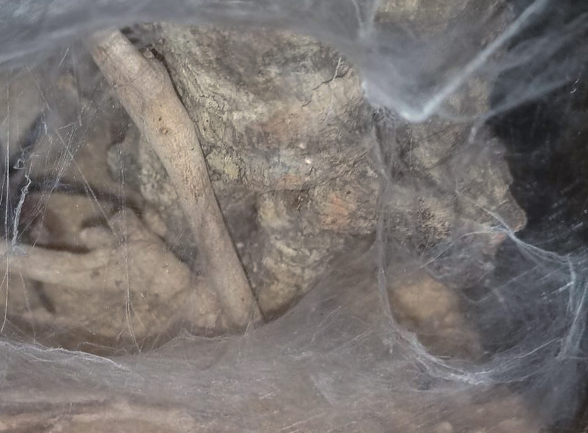

Cartilaginous fishes such as Sharks, use the ampullae of lorenzini to 
detect weak electromagnetic fields, supporting their means of navigation, 
communication and locating mates, prey and predators.

Can we take inspiration from these outsourced and different sensory 
systems and speculate on how they could shape imaginative 
extensions of semi-postbiological bodies in a dystopian future?

Deprived Extension is conceived as porous, high-impedance system.
A set of exposed antennas, functioning as distributed sensing elements 
extends into the environment, passively registering interference, 
proximity, and movement. The signals, shaped through resistance and 
multiplexing, are not resolved into clear data but remain unstable, noisy, 
and contingent.

	

	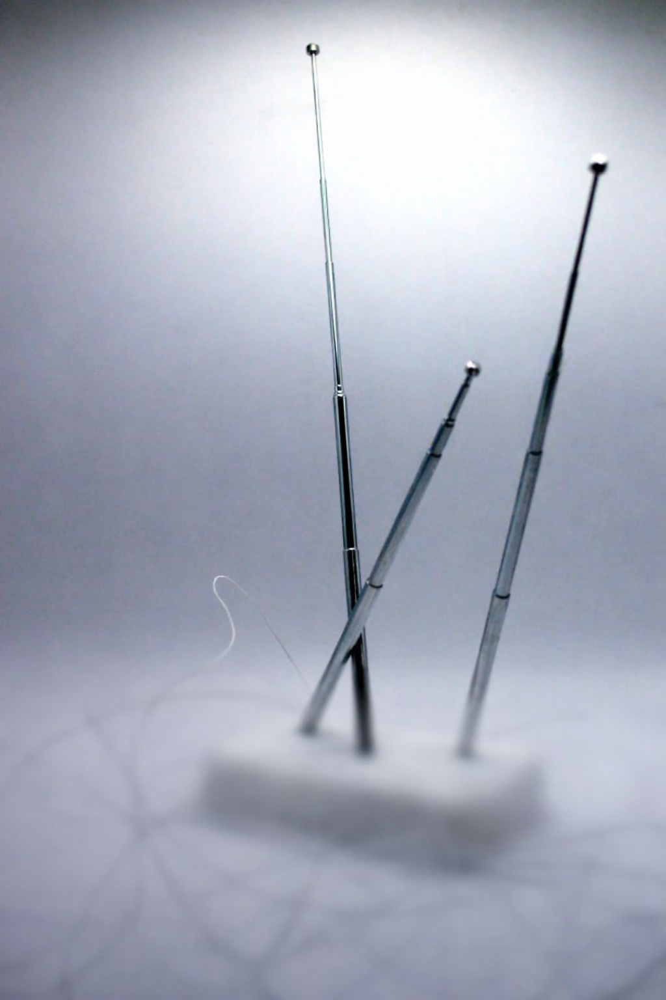

	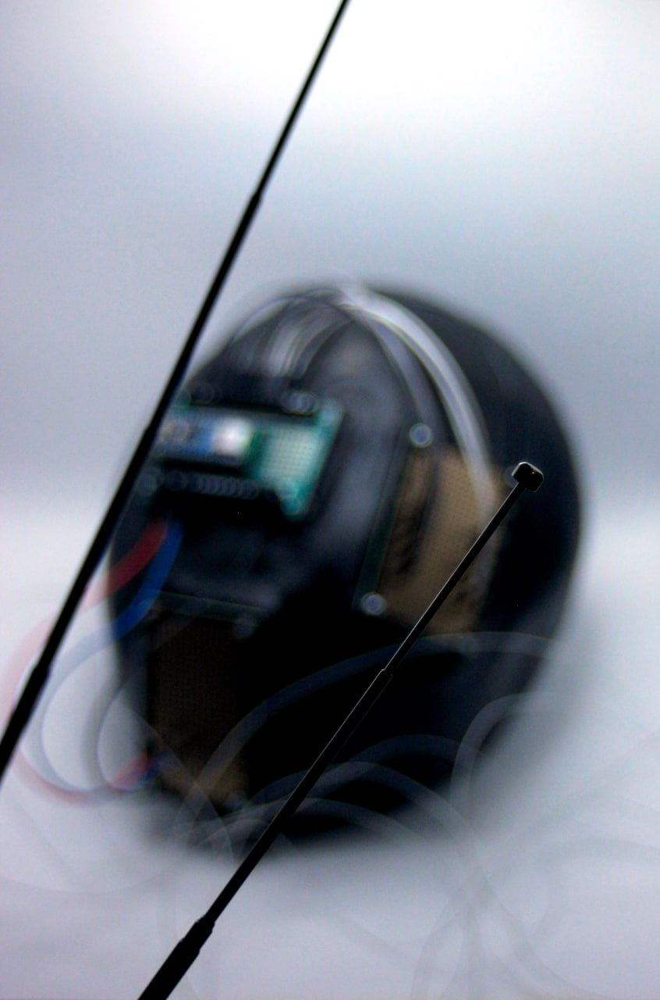
	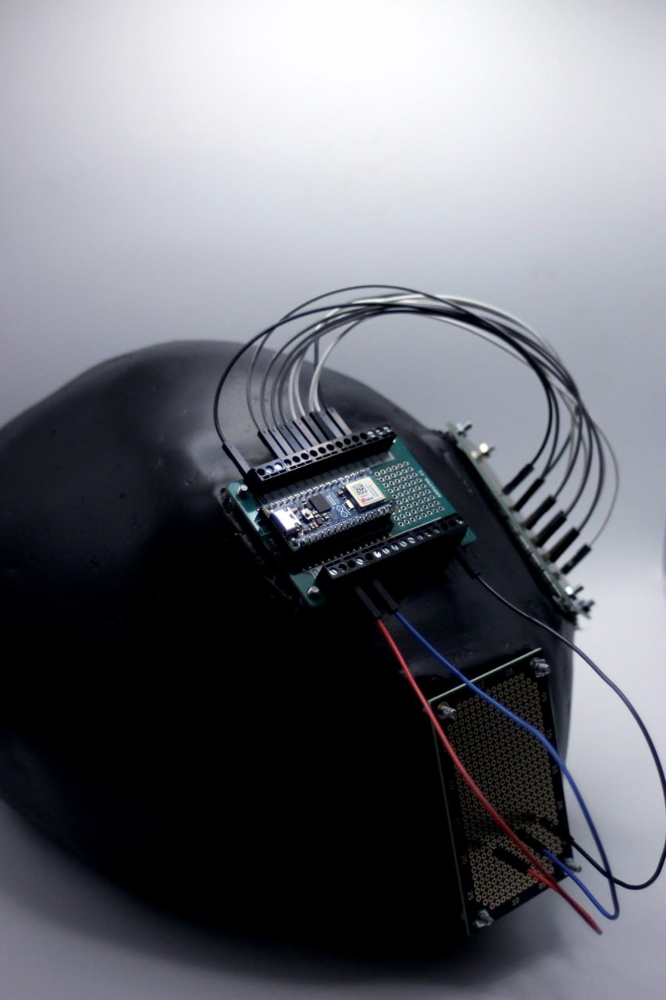

Instead of enhancing clarity, the system introduces a form of sensory 
deprivation and displacement, with vision and hearing being partially 
suspended, replaced by a diffuse, non-local perception of environmental 
change, converted into vibrational inputs underneath the mask.

	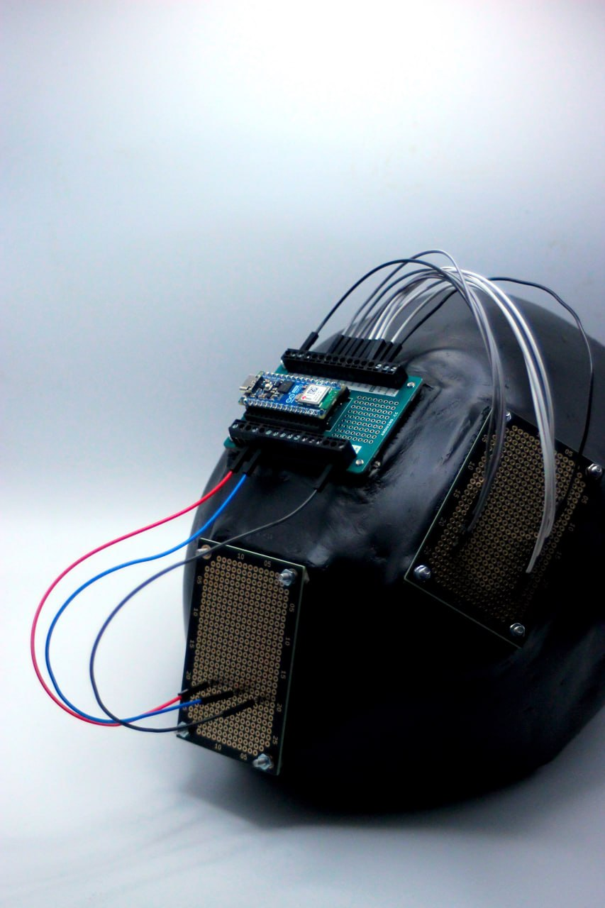

# Progress documentation

	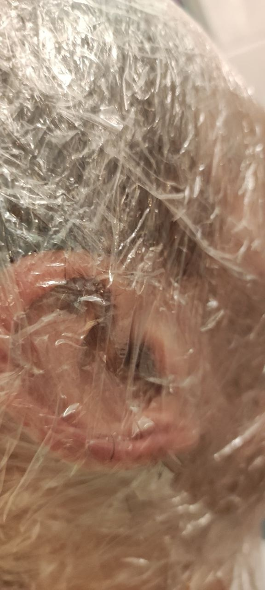
	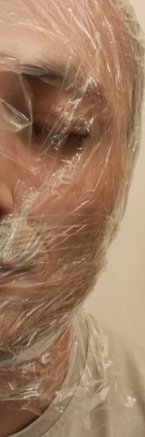
	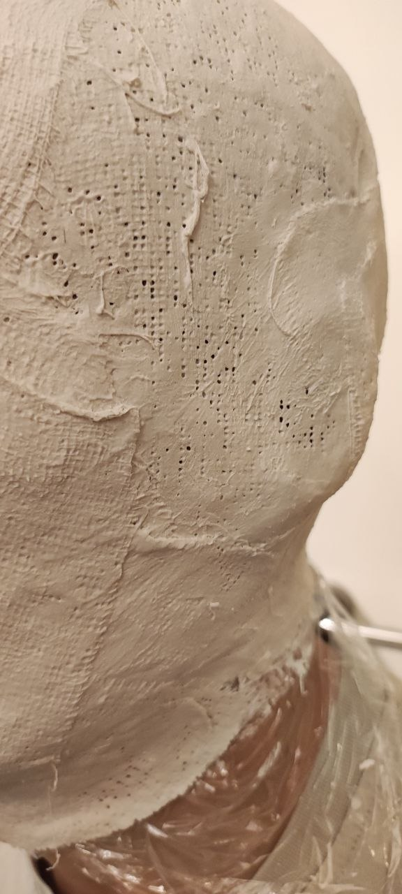
	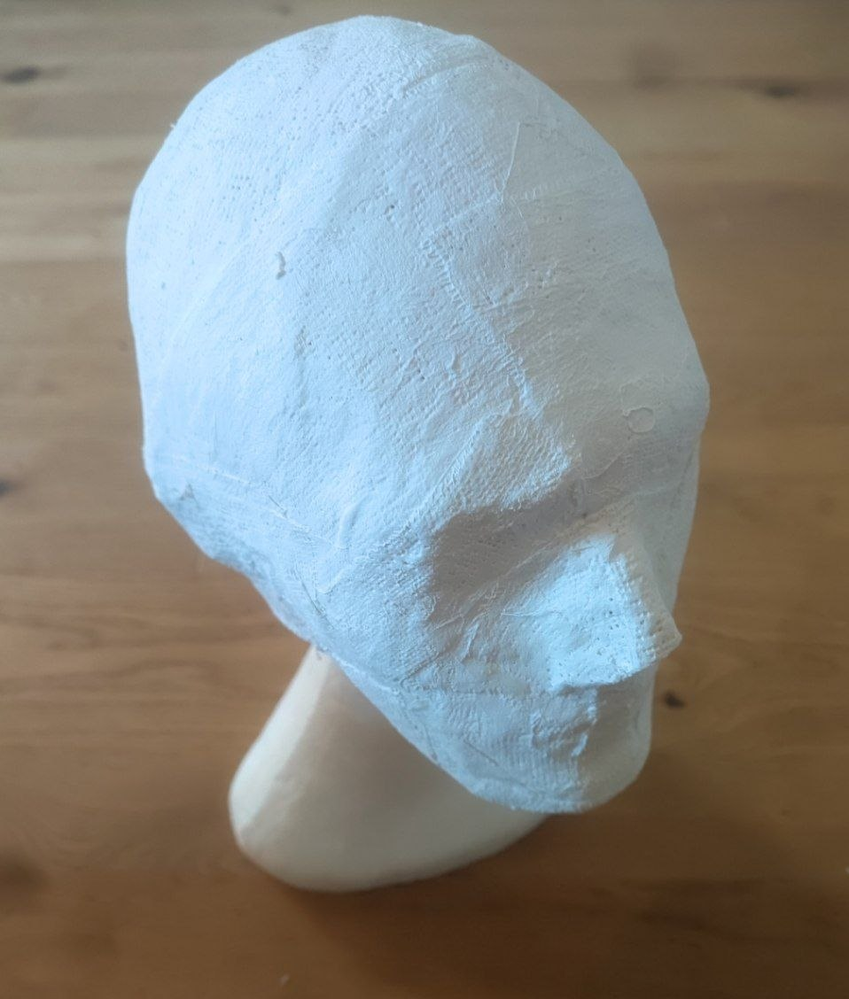
	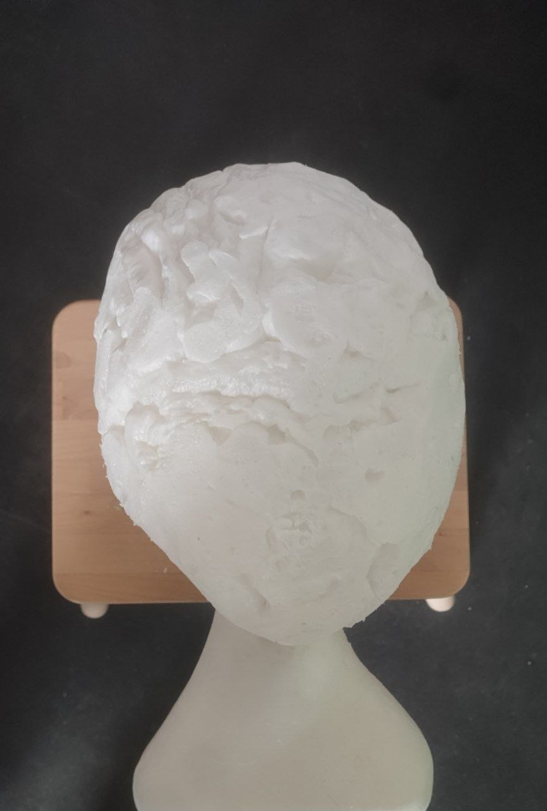
	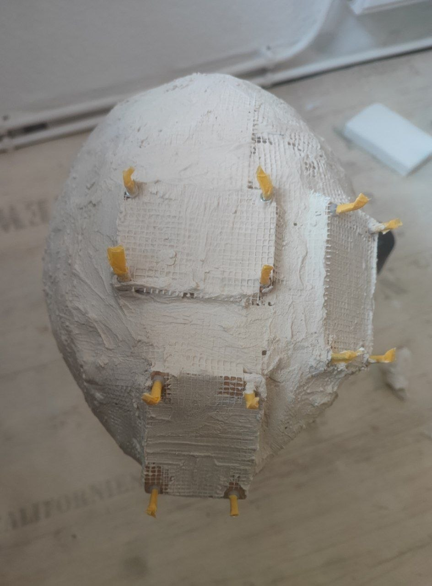
	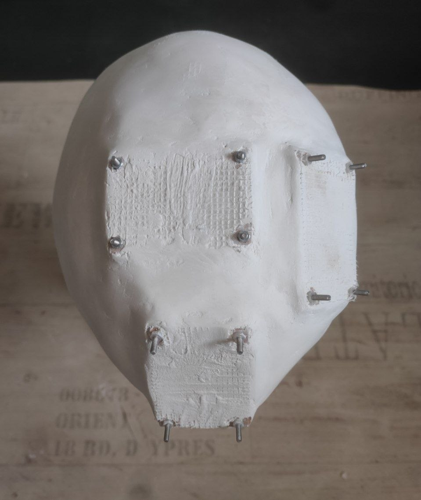

