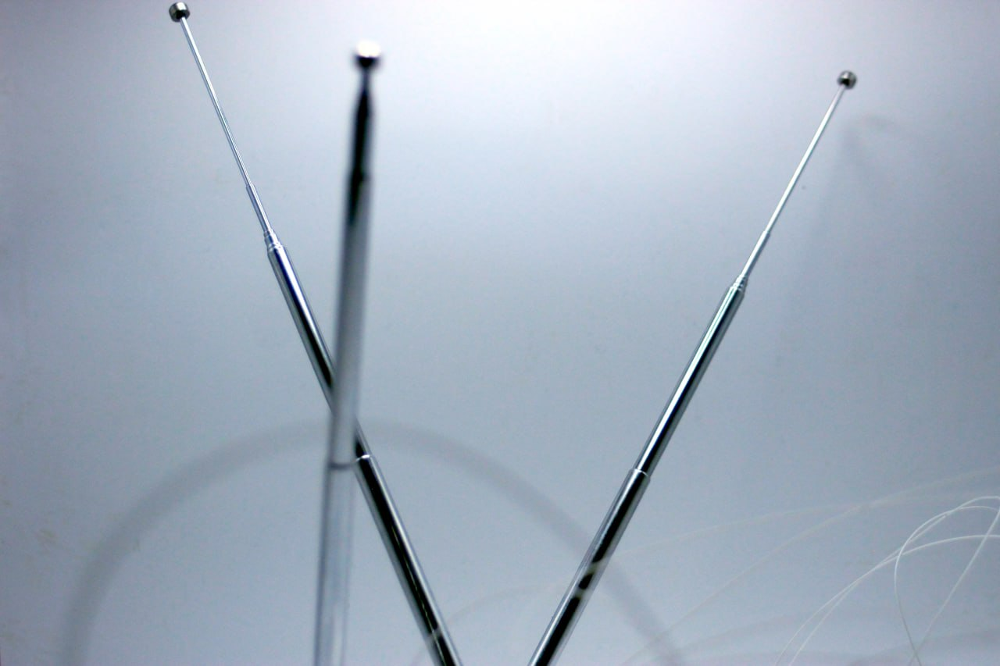

<h1 style="margin: 0 0 0.2rem 0;">Deprived Extension (ongoing)</h1>

(2026)

Arachnids have been roaming the planet for over 400 million years, with a
new record breaking fossil just recently being found. Predating trees and
much of terrestrial fauna, they were amongst the first hunters
of other arthropods on land.  The production of silk, a temporary architecture
later evolving in the lineage of spiders roughly 300 million years ago,
functions not only as a habitat, but as an extended sensory apparatus that
distributes perception across ground and later air.

	
	

Cartilaginous fishes such as sharks use the ampullae of Lorenzini to
detect weak electromagnetic fields, supporting their means of navigation,
communication, and locating mates, prey, and predators.
  
<em>Can we take inspiration from these outsourced and different sensory
systems and speculate on how they could shape imaginative
extensions of semi-postbiological bodies in a dystopian future?</em>
 

	

		

			Deprived Extension is conceived as a porous, high-impedance system.
			A set of exposed antennas, functioning as distributed sensing elements,
			extends into the environment, passively registering interference,
			proximity, and movement. The signals, shaped through resistance and
			multiplexing, are not resolved into clear data but remain unstable, noisy,
			and contingent.
		

		
	

	

		
	

	
	

Instead of enhancing clarity, the system introduces a form of sensory
deprivation and displacement, with vision and hearing being partially
suspended, replaced by a diffuse, non-local perception of environmental
change, palpable through vibrational inputs underneath the mask.

	

# Assembly process

	

		

			
		

		

		
Foil release-layer

	

	

		

			
		

		

		
Applying plaster bandages

	

	

		

			
		

		

		
Removed and patched plaster frame

	

	

		

			
		

		

		
Applying and cutting model foam

	

	

		

			
		

		

		
mounting plates for circuit boards, glued on and integrated with cloth-tape. Sealed with model plaster/glue

	

	

		

			
		

		

		
Last plaster layer before final coating

	

