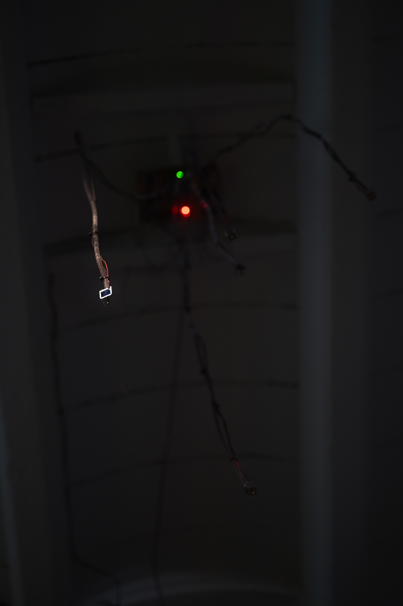
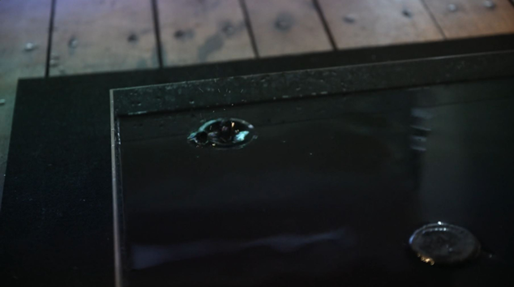

<h1 style="margin: 0 0 0.2rem 0;">Impacts</h1>

(2024)

The North Sea is one of the most heavily trafficked maritime zones.  
Increasing ambient noise levels due to heavy industrial activity are negatively affecting the life and social behaviour of resident, as well as migratory species.
  

  
  

    

      The Installation translates data of underwater noise events within the Exclusive Economic Zone into falling drops of Ink that impinge on a body of water.     
      Loudness levels of pile driving and explosion events control the opening mechanism of five solenoid valves mounted above an acrylic basin.
         
    

    
  

  The impacts are then fed into a network of amplification and reverberation, in an attempt to make them audible yet again, as a brute sound event that is their underlying cause. 

  <video
    src="../../media/hero.mp4"
    controls
    controlsList="nodownload noremoteplayback"
    disablePictureInPicture
    disableRemotePlayback
    playsinline
    style="width: min(900px, 100%); height: auto; display: inline-block;"
  >
    Your browser does not support the video tag.
  </video>

